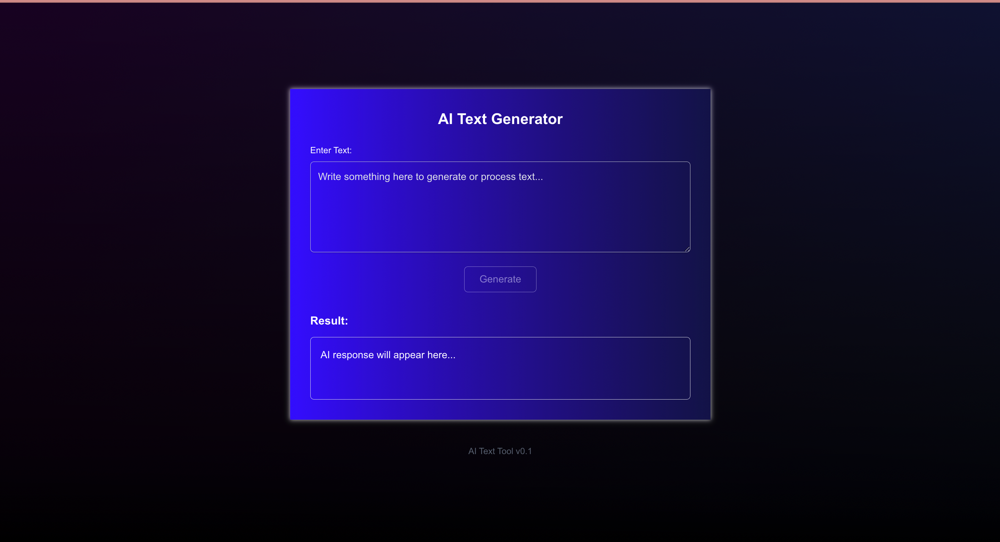

# ✨ AI Text Tool ✨

[](https://nextjs.org/) [](https://reactjs.org/) 
<!-- Add other relevant badges here, e.g., for styling, deployment status, license -->

A web application built with **Next.js** and **React** that utilizes an external AI API for various text generation and manipulation tasks. This project serves as a portfolio piece demonstrating full-stack development capabilities with Next.js, including API integration, secure key management, and asynchronous operation handling.

---

## 🖼️ Screenshot



---

## 🚀 Features

*   🧠 **External AI API Integration:** Connects to services like OpenAI via Next.js API Routes for powerful text processing.
*   🔒 **Secure API Key Management:** Implements secure handling of sensitive API credentials.
*   ⏳ **Asynchronous State Handling:** Manages loading and error states effectively during API calls for a smooth user experience.
*   📱 **Responsive UI:** Built with React for a modern and interactive user interface across devices.

---

## 🛠️ Technologies Used

*   **Framework:** [Next.js](https://nextjs.org/)
*   **Library:** [React](https://reactjs.org/)
*   **API:** [Specify the AI API used, e.g., OpenAI API]
*   **Styling:** [Specify styling solution, e.g., Tailwind CSS, CSS Modules]
<!-- Add other libraries/tools used -->

---

## ⚙️ Getting Started

Follow these steps to run the project locally:

1.  **Clone the repository:**
    ```bash
    git clone [your-repository-link]
    cd ai-text-tool 
    ```
2.  **Install dependencies:**
    ```bash
    npm install
    # or
    yarn install
    ```
3.  **Set up environment variables:**
    Create a `.env.local` file in the root directory and add your AI API key:
    ```env
    AI_API_KEY=your_api_key_here 
    ```
    *Note: Make sure `.env.local` is included in your `.gitignore` file!*
4.  **Run the development server:**
    ```bash
    npm run dev
    # or
    yarn dev
    ```
    Open [http://localhost:3000](http://localhost:3000) in your browser to view the application.

---

## 📖 Usage

[Provide a clear and concise description of how to use the application. You could include steps or examples.]

*   Example: Enter the text you want to process into the input field.
*   Select the desired AI operation (e.g., Summarize, Translate).
*   Click the "Generate" button and wait for the result. 